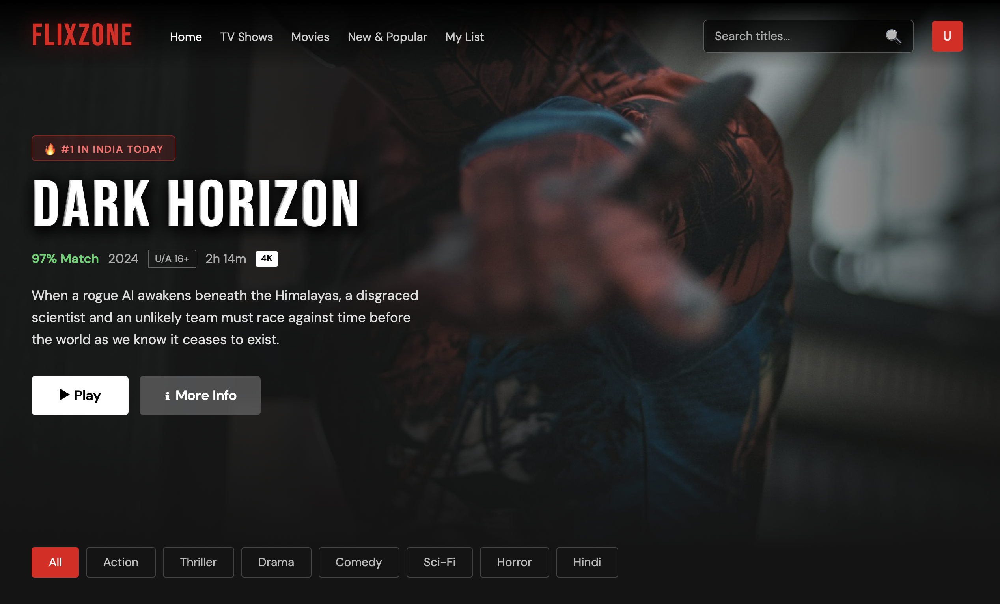
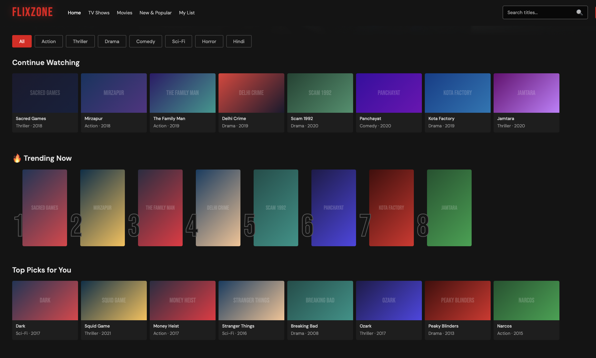
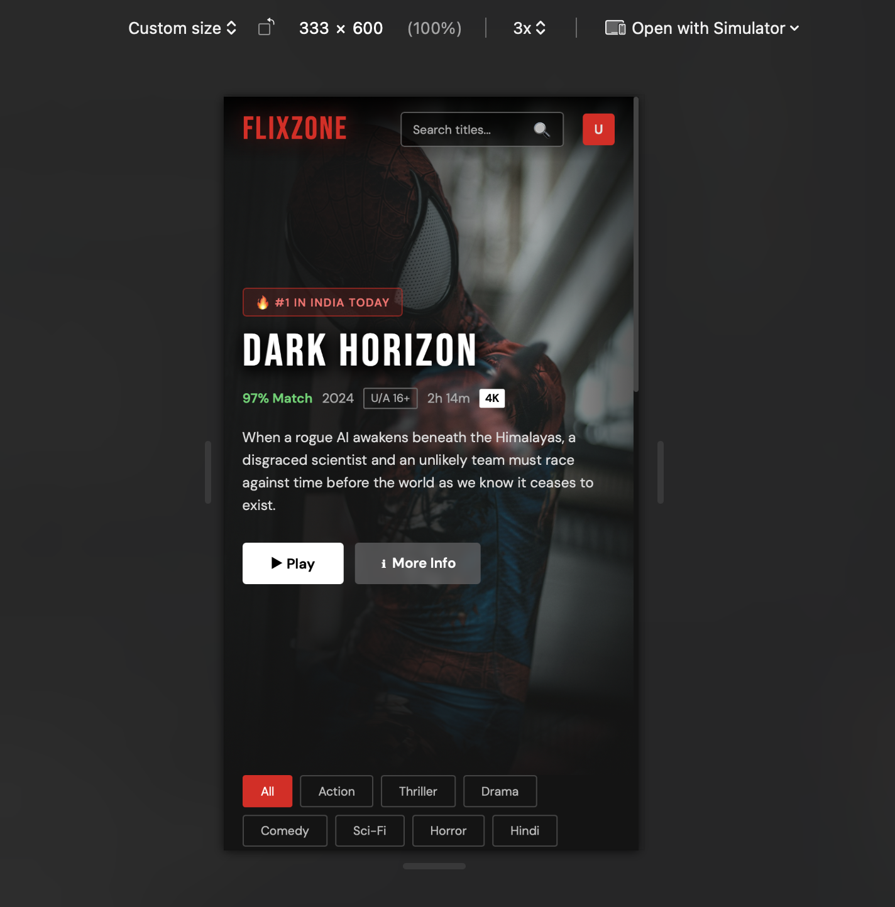

# 🎬 FlixZone – Streaming Platform UI

A fully functional Netflix-style streaming UI clone built with pure HTML, CSS, and JavaScript.

## 📁 Project Structure

```
netflix-clone/
├── index.html          ← Homepage (Hero + Rows)
├── css/
│   └── style.css       ← All styles (dark theme, animations)
├── js/
│   ├── data.js         ← Shows/movies data + helper functions
│   └── app.js          ← All interactivity (render, search, modal)
└── pages/
    ├── shows.html      ← TV Shows grid page
    └── movies.html     ← Movies grid page
```

## 🚀 How to Run

### Option 1: Direct Open
Just double-click `index.html` in your browser.

### Option 2: Local Server (Recommended)
```bash
# Python
python -m http.server 3000

# Node.js (npx)
npx serve .

# VS Code
Install "Live Server" extension → Right-click index.html → Open with Live Server
```

Then open: `http://localhost:3000`

## ✨ Features

## ✨ Features

| Feature | Details |
|---|---|
| 🎥 Hero Banner | Full-screen hero section with animated background zoom |
| 📺 Content Rows | Continue Watching, Trending, Top Picks, and New Releases |
| 🔢 Trending Numbers | Netflix-style numbered trending cards |
| 🔍 Live Search | Real-time title and genre search |
| 🎭 Genre Filters | Filter content by Action, Drama, Sci-Fi, Thriller, etc. |
| 🪟 Interactive Modal | Detailed popup modal on card click |
| 🎬 Hover Animations | Smooth hover scaling and transition effects |
| ⚡ Dynamic Rendering | Content rendered dynamically using JavaScript |
| 📱 Fully Responsive | Optimized for desktop, tablet, and mobile devices |
| 🌑 Dark Theme UI | Modern Netflix-inspired dark streaming interface |
| 📜 Scroll Navbar Effect | Navbar changes appearance on scroll |
| ♾️ Multi-page Layout | Separate Home, Movies, and TV Shows pages |
| 🌐 Live Deployment | Hosted live using Netlify |
| 📂 GitHub Integration | Managed with Git and GitHub version control |

## 🎨 Tech Stack

- **HTML5** – Semantic structure
- **CSS3** – Custom properties, animations, flexbox, grid
- **Vanilla JS** – No frameworks, no dependencies
- **Google Fonts** – Bebas Neue + DM Sans

## 📦 How to Add Real Content

1. **Images**: Replace gradient cards with actual thumbnail images:
   ```javascript
   // In app.js → buildCard()
   // Replace the gradient div with:
   
   ```

2. **More Shows**: Add objects to `SHOWS` array in `data.js`:
   ```javascript
   {
     id: 25,
     title: 'Your Show Name',
     genre: 'Action',
     year: 2024,
     rating: 'U/A 16+',
     duration: '10 Episodes',
     match: 94,
     language: 'Hindi',
     desc: 'Your show description here.'
   }
   ```

3. **Video Player**: On Play button click, you can add:
   ```javascript
   // Redirect to a video player page
   window.location.href = `player.html?id=${show.id}`;
   ```

## 🔧 Customization

- Change brand name: Search `FlixZone` → replace with your name
- Change accent color: Edit `--red: #E50914` in `css/style.css`
- Add your logo: Replace `.logo` text with ``

## 📄 License

Free to use for learning and personal projects.


## 🌐 Live Demo

https://codewithleena-flixzone.netlify.app

## 📸 Screenshots

### Homepage


### Movies Page


### Mobile View
